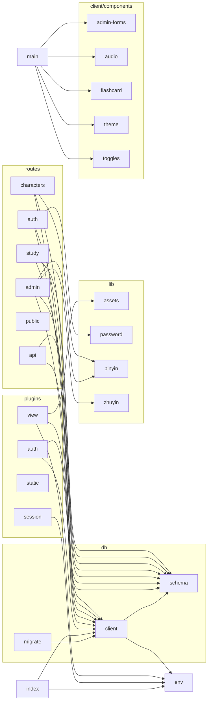
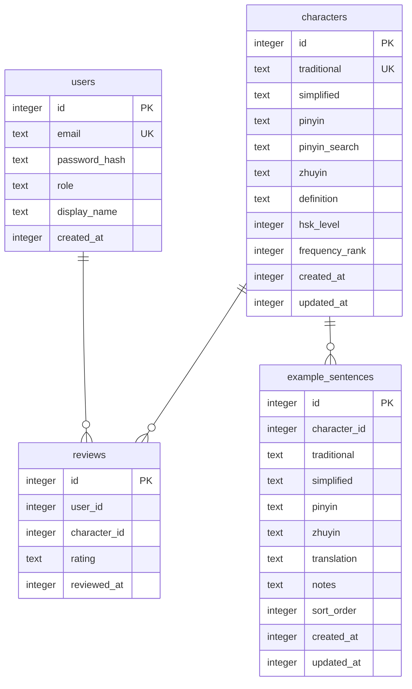
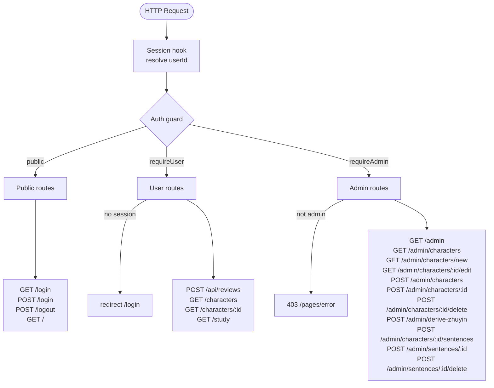
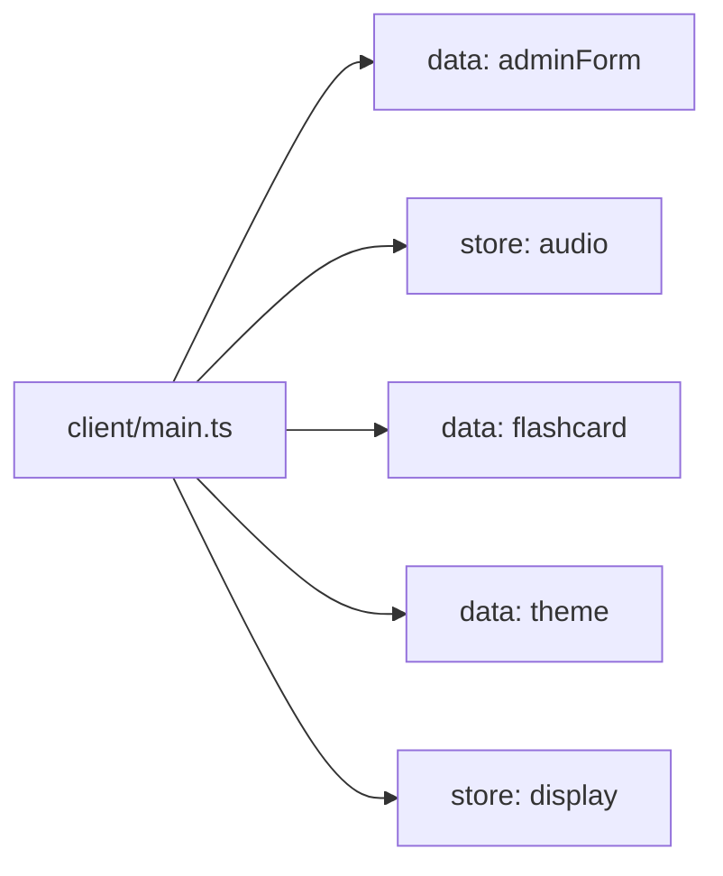

# Sweet Potato — Codegraph
<!-- Generated 2026-06-27T13:37:51.602Z by scripts/codegraph.ts — run `pnpm codegraph` to update -->

## Module Dependencies

## Database Schema

## Request Flow & Auth Guards

## Alpine Client Components

